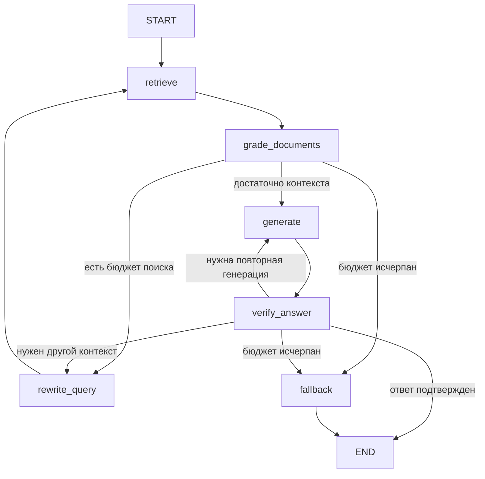

# LangGraph RAG

Пример RAG-пайплайна на LangGraph с проверкой источников и контролируемыми повторными попытками.

> Статус: подготовка реализации. Этот коммит содержит описание проекта и проверку структуры репозитория, но не работающий пайплайн. Команды запуска появятся вместе с кодом.

## Цель проекта

Показать, как выразить retrieval-augmented generation через граф состояний с явной маршрутизацией, ограниченным бюджетом повторов и отказом при недостатке доказательств.

## Планируемая архитектура

## Требования к реализации

- Независимое состояние каждого запроса: без общего идентификатора сессии и утечки счетчиков между пользователями.
- Гибридный поиск BM25 и векторного ретривера с объединением рангов.
- Идемпотентная индексация со стабильными идентификаторами фрагментов.
- Отдельные проверки обоснованности ответа и соответствия вопросу.
- Ограничения на число попыток поиска и генерации.
- Проверка корректности номеров цитат и явный отказ при недостатке контекста.
- Настройка доступных моделей через окружение, без API-ключей в репозитории.
- Офлайн-тесты маршрутизации, изоляции запросов и индексации.

## Ограничения

Планируется учебный инженерный пример, а не готовый production-сервис. LLM-проверка не гарантирует фактическую корректность. Для развертывания потребуются авторизация, ограничения запросов, наблюдаемость и проверка на целевом наборе данных.

## Статус проверки

Workflow `Repository structure` проверяет только наличие непустого README. Это не тест реализации RAG и не подтверждение готовности проекта.
