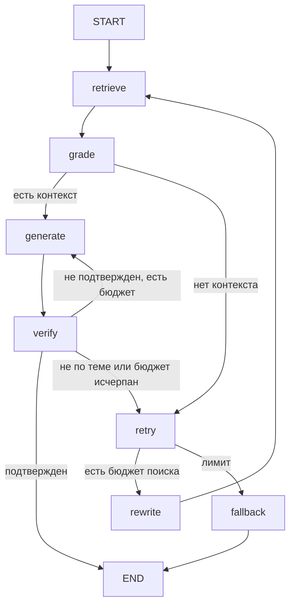

# LangGraph RAG

Инженерный reference-проект RAG на LangGraph: гибридный поиск, фильтрация контекста, ответы с цитатами и ограниченные циклы самопроверки.

Это учебная реализация для небольших корпусов, не production-сервис. LLM-верификация снижает некоторые риски, но не гарантирует истинность ответа.

## Архитектура



- `retrieve`: BM25 либо BM25 + локальные embeddings, объединение через weighted reciprocal rank fusion.
- `grade`: structured-output оценка полезности каждого фрагмента.
- `generate`: ответ по пронумерованному контексту.
- `verify`: раздельные оценки groundedness и соответствия вопросу; дополнительная проверка наличия и диапазона номеров цитат.
- `rewrite`: переформулировка с учетом критики.
- `fallback`: честный отказ после исчерпания бюджета.

Состояние каждого запроса независимо: чекпоинтер и общая сессия не используются. Лимит генераций применяется к каждому набору контекста; общий максимум — произведение лимитов поиска и генерации. Только проверенный ответ возвращается клиенту. Список источников содержит лишь номера, использованные в ответе.

## Быстрый старт

Python 3.11 или 3.12:

```bash
git clone https://github.com/AntoGA/langgraph-rag.git
cd langgraph-rag
python -m venv .venv
source .venv/bin/activate
# Windows PowerShell: .venv\Scripts\Activate.ps1
pip install -e '.[dev]'
cp .env.example .env
```

В `.env` задайте `ANTHROPIC_API_KEY`, `GENERATION_MODEL`, `UTILITY_MODEL`. Идентификаторы моделей должны быть доступны вашему аккаунту Anthropic: непроверенные названия моделей по умолчанию не заданы.

```bash
rag ingest
rag ask 'Сколько попыток поиска разрешено в демонстрационной политике?'
rag serve
```

```bash
curl http://127.0.0.1:8000/ask -H 'Content-Type: application/json' \
  -d '{"question":"Какие форматы документов поддерживаются?"}'
```

Swagger UI: `http://127.0.0.1:8000/docs`. `/health` проверяет только работоспособность HTTP, не доступность модели или индекса.

## Индексация и retrieval

Положите собственные `.md` / `.txt` UTF-8 документы в `data/raw`. Демонстрационный `demo.md` содержит вымышленные правила. PDF/OCR не реализованы.

`rag ingest` атомарно заменяет JSON-снимок индекса: повторный запуск не дублирует документы, удаленные файлы исчезают. ID — SHA-256 источника, позиции и текста. Не запускайте несколько индексаторов одновременно. Перезапустите API после переиндексации: runtime кеширует снимок.

По умолчанию используется BM25 без загрузки embedding-модели. Для гибридного поиска:

```bash
pip install -e '.[embeddings]'
# В .env: RETRIEVAL_MODE=hybrid
```

При первом запросе embedding-модель скачивается, а векторы корпуса вычисляются в памяти. Это осознанное упрощение: большой корпус требует векторного хранилища, пакетной индексации и персистентных embeddings.

## Конфигурация

| Переменная | Значение по умолчанию |
|---|---|
| `DATA_DIR` | `data/raw` |
| `INDEX_PATH` | `data/index/chunks.json` |
| `RETRIEVAL_MODE` | `bm25` (`hybrid` опционально) |
| `EMBEDDING_MODEL` | `sentence-transformers/paraphrase-multilingual-MiniLM-L12-v2` |
| `TOP_K` | 4 |
| `DENSE_WEIGHT` | 0.6 |
| `CHUNK_SIZE` / `CHUNK_OVERLAP` | 900 / 150 символов |
| `MAX_RETRIEVAL_ATTEMPTS` | 2 |
| `MAX_GENERATION_ATTEMPTS` | 2 на набор контекста |

Относительные пути считаются от рабочей директории. Фрагменты отправляются Anthropic; embeddings в hybrid вычисляются локально. Вызовы LLM платные. Грейдинг выполняет отдельный вызов на каждый кандидат, а не один общий запрос.

## Проверки

```bash
ruff check src tests
pytest
```

Тесты используют поддельную модель и локальные документы, не требуют ключей или скачивания embeddings. Проверяются успешный маршрут, отказ, повторы, изоляция запросов, номера цитат, дедупликация индекса и API. Workflow `Tests` запускает их на Python 3.11/3.12. Workflow `Repository structure` проверяет только README.

Диапазоны зависимостей заданы в `pyproject.toml`, lock-файл пока отсутствует. Прохождение CI следует проверять на странице PR; наличие workflow само по себе не означает успешный запуск.

## Ограничения и безопасность

- Нет авторизации, rate limiting, очереди задач и диалоговой памяти. Не публикуйте API напрямую в интернет.
- Документы считаются недоверенными данными; prompt-инструкции не дают абсолютной защиты от prompt injection.
- Валидные номера цитат не доказывают, что каждое утверждение поддержано источниками.
- Отказ означает отсутствие проверенного ответа в рамках бюджета, а не доказанное отсутствие информации во всем корпусе.
- Исключения провайдера возвращаются как ошибка сервиса, а не как отказ из-за отсутствия знаний.
- В репозитории нет заявленных измерений качества/латентности. Для оценки нужны размеченные вопросы и независимая проверка утверждений.
- JSON-индекс, линейный dense-поиск и последовательный грейдинг предназначены для демонстрации, не масштабирования.

## Структура

`src/rag/index.py` — загрузка и поиск; `pipeline.py` — граф и маршрутизация; `models.py` — адаптер Anthropic; `runtime.py` — инициализация; `cli.py` и `api.py` — интерфейсы; `tests/` — офлайн-проверки.

## Документация используемых инструментов

- [LangGraph](https://docs.langchain.com/oss/python/langgraph/overview)
- [Anthropic API](https://docs.anthropic.com/)
- [Sentence Transformers](https://www.sbert.net/)

MIT License. Автор: AntoGA.
